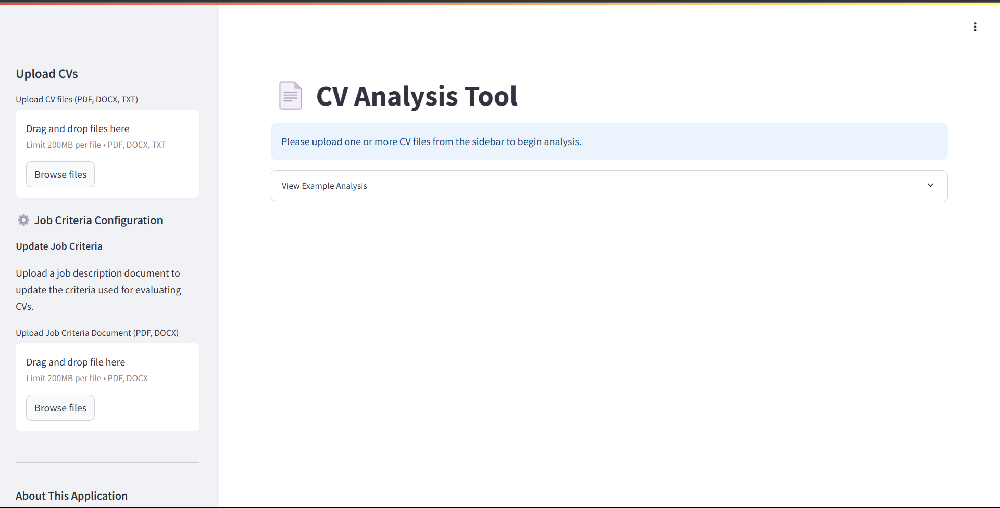

# CV Analysis Tool

A Streamlit-based application that analyzes multiple CV/resume documents using a sophisticated AI model, providing detailed feedback and comparison tools for recruitment processes.



## Overview

The CV Analysis Tool interfaces with an Azure-hosted FastAgent API to help recruiters and hiring managers efficiently evaluate multiple candidate CVs against job requirements. The application provides a user-friendly interface for uploading documents and reviewing analysis results with visual comparisons.

### Key Features

- **Multi-CV Upload**: Support for PDF, DOCX, and TXT file formats
- **AI-Powered Analysis**: Detailed evaluation using a sophisticated AI analysis engine
- **Smart Response Formatting**: Clean, readable presentation of AI analysis results
- **Individual Analysis**: Comprehensive breakdown of each CV against predefined criteria
- **Match Scoring**: Visual representation of how well each candidate matches requirements
- **Comparative Summary**: At-a-glance view of all candidates' match percentages
- **Feedback System**: Rate the quality of analysis to improve future results
- **Export Functionality**: Download analysis results in CSV format
- **Reset Capability**: Clear results and analyze new CVs without restarting

## Getting Started

### Prerequisites

- Python 3.8+
- Azure FastAPI endpoint credentials (username and password)

### Installation

1. **Clone the repository**

   ```bash
   git clone https://github.com/yourusername/cv-analysis-tool.git
   cd cv-analysis-tool
   ```

2. **Create and configure the environment file**

   Create a `.env` file in the root directory with the following content:

   ```
   API_USERNAME=your_username_here
   API_PASSWORD=your_password_here
   API_BASE_URL=https://hr-demo-app.ambitiousriver-e696f55c.australiaeast.azurecontainerapps.io/api/v1
   REVISION_ID=5ccc4a42-1e24-4b82-a550-e7e9c6ffa48b
   ```

   Replace `your_username_here` and `your_password_here` with your actual API credentials.

3. **Install Python dependencies**

   ```bash
   # Create and activate a virtual environment (recommended)
   python -m venv .venv
   source .venv/bin/activate  # On Windows: .venv\Scripts\activate

   # Install required packages
   pip install -r requirements.txt
   ```

4. **Run the application**

   ```bash
   streamlit run app.py
   ```

   Or use the provided startup scripts:

   ```bash
   # On Linux/macOS
   chmod +x start_app.sh
   ./start_app.sh

   # On Windows
   start_app.bat
   ```

   The startup scripts will check for the existence of the virtual environment and `.env` file, creating them if necessary.

5. **Access the application**

   Open your browser and navigate to `http://localhost:8501`

## How to Use

1. **Upload CVs**: Use the sidebar to upload one or more CV files (PDF, DOCX, or TXT)
2. **Run Analysis**: Click the "Analyze CVs" button to process all documents
3. **Review Results**:
   - Navigate between individual tabs to see detailed analysis for each CV
   - View formatted analysis reports with skills assessments and recommendations
   - See visual score representations with progress bars
   - Use the summary table to compare all candidates side by side
   - Look for highlighted match percentages to identify top candidates
   - Provide feedback using the thumbs up/down buttons
4. **Export Data**: Download results as CSV for further processing or sharing
5. **Reset and Restart**: Use the "Clear Results" button to analyze a new set of CVs

## Project Structure

- **app.py**: Main Streamlit application file containing the UI and API integration logic
- **.env**: Environment variables file with API credentials (not checked into version control)
- **requirements.txt**: Python dependencies for the project including python-dotenv
- **.gitignore**: Specifies files to exclude from version control (includes .env)
- **start_app.sh**: Bash script to start the Streamlit app with environment setup
- **start_app.bat**: Windows batch file to start the Streamlit app with environment setup
- **tests/**: Directory containing test files

### Component Breakdown

#### APIClient Class

Handles all interactions with the FastAgent API, including:

- Submitting CVs for analysis with proper authentication
- Formatting payloads according to API requirements
- Sending user feedback on analysis quality
- Error handling for API requests

#### Text Extraction Functions

Utilities that handle various document formats:

- `extract_text_from_file()`: Detects file type and routes to appropriate extractor
- `extract_text_from_pdf()`: Processes PDF documents using PyPDF2
- `extract_text_from_docx()`: Extracts text from Word documents using docx2txt

#### Response Formatting

Smart response processing to ensure readable output:

- JSON parsing to extract the relevant analysis sections
- Extraction of scores from different text formats
- Multiple fallback options to handle various response structures
- Conversion of raw scores to visual progress indicators

#### UI Components

The application is divided into:

- Sidebar for input controls and application information
- Tab-based interface for individual CV analysis
- Summary table for at-a-glance comparison
- Feedback mechanisms for continuous improvement
- Progress indicators during analysis
- Reset functionality to analyze new CVs

## Testing

The application includes a comprehensive test suite that ensures all components work correctly:

- **Unit Tests**: Test individual functions and classes in isolation

  - `test_api_client.py`: Tests the API client functionality and API interactions
  - `test_text_extraction.py`: Tests document text extraction functions
  - `test_ui_components.py`: Tests UI components and interactions

- **Integration Tests**: Test how components work together
  - `test_app_flow.py`: Tests the end-to-end application flow

To run the tests:

```bash
# Run all tests
pytest

# Run specific test modules
pytest tests/test_api_client.py
pytest tests/test_text_extraction.py
pytest tests/test_ui_components.py
pytest tests/integration/test_app_flow.py

# Run tests with coverage report
pytest --cov=app
```

## API Integration

The application interacts with the following Azure-hosted API endpoints:

- `POST /api/v1/chat`: Submit CVs for analysis (Basic authentication required)
- `PUT /api/v1/messages/{message_id}/feedback`: Submit feedback on analysis quality

## Security Notes

- API credentials are stored in the `.env` file which is not committed to version control
- The application uses HTTP Basic Authentication for API requests
- Ensure your `.env` file is properly secured and not shared publicly

## Configuration Options

- Modify the environment variables in the `.env` file to connect to a different server or use different credentials
- Extend `extract_text_from_file()` to support additional document formats
- Adjust the UI layout by modifying the Streamlit component structure

## Important Notes

- This application uses a predefined set of evaluation criteria configured in the API
- The current implementation is designed to work with a specific revision ID in the FastAgent API
- If you need to make changes to the criteria or use a different revision ID, update the values in your `.env` file
- The "Clear Results" button allows you to analyze new CVs without restarting the application

## Recent Improvements

- **Smart Response Formatting**: Analysis results are now cleanly formatted rather than displaying raw JSON data
- **Enhanced Score Visualization**: Multiple methods for extracting and displaying scores from AI analysis
- **Reset Functionality**: Added ability to clear results and analyze new CVs without restarting
- **Improved Error Handling**: Better feedback and recovery from API errors
- **Enhanced UI**: More informative explanations and progress indicators
